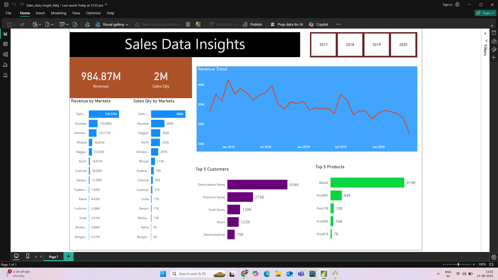

# Sales Data Insight - A Power BI Project

Welcome to the repository for my "Sales Data Insight" project. This project involves the analysis of sales data of `ATLIQ HARDWARE` to uncover trend, track key performance indicators (KPIs), and provide actionable insights through an interactive Power BI dashboard.

## 📊 Dashboard Preview

---

## 📝 Project Overview

This project aims to solve the common business problem of having vast amounts of sales data with no easy way to interpret it. The interactive dashboard centralizes key metrics and provides a user-friendly interface for stakeholders to explore sales performance across different dimensions like region, product, and time.

### 🎯 Key Objectives
- To develop a comprehensive sales report to monitor KPIs like Total Revenue and Sales Growth.
- To identify top-performing products, regions, and sales representatives.
- To analyze sales trends on a monthly, quarterly, and yearly basis.
- To provide a dynamic and interactive dashboard for data-driven decision-making.

---

## Dataset

The dataset used for this analysis is a [e.g., fictional retail sales dataset, public sales dataset from Kaggle, etc.]. It contains transactional data including information on:
- **Order Details:** Order ID, Order Date, Ship Date.
- **Product Details:** Product Name, Category, Sub-Category.
- **Customer & Location:** Customer Name, City, State, Country/Region.
- **Sales Figures:** Sales, Quantity, Discount, Profit.

---

## 🛠️ Tools & Technologies

- **Microsoft Power BI:** The primary tool for data modeling, analysis, and visualization.
- **Power Query:** Used for Extracting, Transforming, and Loading (ETL) the data.
- **DAX (Data Analysis Expressions):** Used for creating complex calculations and custom measures.

---

## 🔄 Project Workflow (ETL Process)

1.  **Data Extraction:** Connected to the source data from [e.g., an Excel file, a CSV file, a SQL database].
2.  **Data Transformation & Cleaning (Power Query):**
    - Handled missing values and removed duplicates.
    - Corrected data types for columns (e.g., converting text to date).
    - Created conditional columns to segment data [e.g., created a 'Profitability Status' column based on profit].
    - Merged/Appended queries as needed [mention if you did this].
3.  **Data Modeling:**
    - Designed a **Star Schema** with one fact table (Sales) and multiple dimension tables (Date, Product, Customer).
    - Established relationships between tables based on primary and foreign keys.
    - Optimized the data model for performance.
4.  **DAX Calculations:**
    - Created over [e.g., 20+] DAX measures to calculate key business metrics.
    - Implemented Time Intelligence functions to analyze Year-over-Year (YoY) Growth and Year-to-Date (YTD) Sales.
5.  **Report & Visualization:**
    - Designed an intuitive and visually appealing multi-page report.
    - Used a variety of visuals (bar charts, line charts, maps, cards, slicers) to represent the data effectively.
    - Implemented interactive features like drill-throughs, bookmarks, and tooltips for an enhanced user experience.

---

## 📈 Key Insights & Findings

-In conclusion, the declining sales trend in your 2017-2020 data, particularly the sharp drop in 2020, is a reflection of the severe economic shock induced by the COVID-19 pandemic. The combination of supply chain  disruptions, a significant shift in consumer priorities, and widespread economic uncertainty created a challenging environment for businesses across most sectors in India.
---

## 🔗 Connect with Me

- **Author:** Ashish Yadav
- **LinkedIn:** www.linkedin.com/in/ashish75585  
Feel free to reach out if you have any questions or would like to collaborate on future projects!
